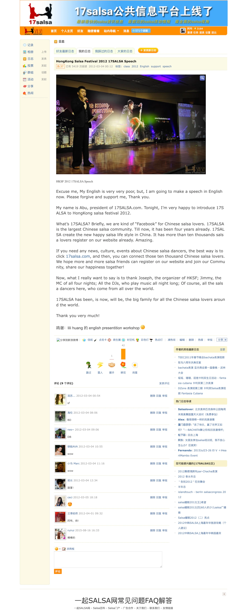
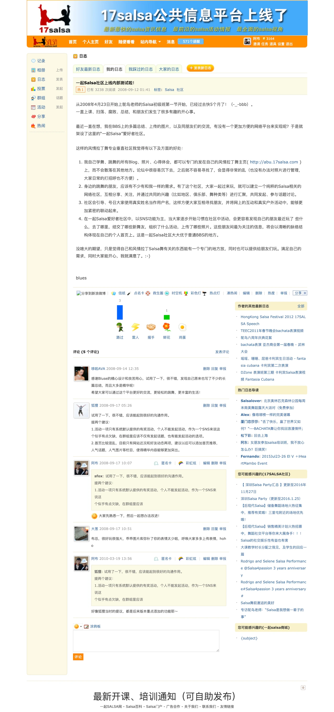
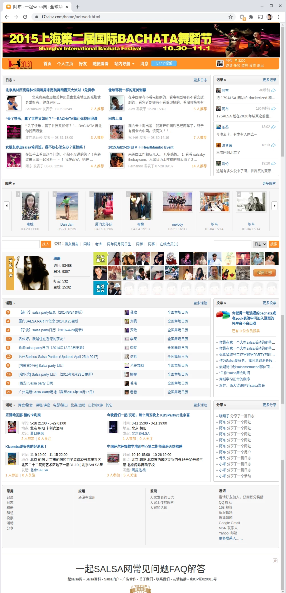

# 17salsa.com

In the vibrant world of Latin dance and music, there exists an organization that embodies the spirit of passion, inclusivity, and cultural celebration. 17SALSA, a nonprofit association founded on October 17, 2008, stands as a testament to the global love for SALSA, offering professional, unbiased, and equitable services to SALSA enthusiasts across the spectrum.

At its heart, 17SALSA is a dynamic force dedicated to the promotion and preservation of SALSA culture. Its mission? To make the joy of dance accessible to every individual, regardless of their background or experience. Whether you're a beginner stepping onto the dance floor for the first time or a seasoned pro, 17SALSA ensures that everyone feels welcome and valued.

With an impressive history of fostering SALSA's growth, 17SALSA has curated a space where Latin dance aficionados come together. Their signature platform, "一起 SALSA 网" (Yi Qi SALSA), is a bustling online hub that encourages genuine interactions, providing a haven for SALSA enthusiasts to express themselves and connect with others who share their passion.

In this journey, we invite you to delve into the rich tapestry of 17SALSA's journey, exploring its unwavering commitment to professionalism, neutrality, and equality. Join us as we uncover how 17SALSA has transformed into a global community, redefining the way SALSA is celebrated and cherished worldwide.

## Screenshots

| Salsa Congress | Blog | Portal |
| --- | --- | --- |
|  |  |  |

## Article & Report

1. [17salsa Founding Report, Abu, Oct 2008](docs/17salsa%20Founding%20Report,%20Abu,%20Oct%202008.pdf)
1. [17salsa Article 4th Edition, Abu, Oct 2010](docs/17salsa%20Article%204th%20Edition,%20Abu,%20Oct%202010.pdf)
1. [17salsa Anniversary Report Slides, Abu, Sep 2009](docs/17salsa%20Anniversary%20Report%20Slides,%20Abu,%20Sep%202009.pdf)
1. [Salsa Enthusiast Research Report Slides, Ava, Sep 2009](docs/Salsa%20Enthusiast%20Research%20Report%20Slides,%20Ava,%20Sep%202009.pdf)

## Meetings

1. [17salsa Committee 2nd Meeting, Abu, Mar 2010](docs/17salsa%20Committee%202nd%20Meeting,%20Abu,%20Mar%202010.pdf)[^1]
1. [17salsa Committee 3nd Meeting, Abu, Oct 2010](docs/17salsa%20Committee%203nd%20Meeting,%20Abu,%20Oct%202010.pdf)[^1]
1. [17salsa Advisors and Committees Address Book, Nov 2011](docs/17salsa%20Advisors%20and%20Committees%20Address%20Book,%20Nov%202011.xls)[^1]

[^1]: Password Protected

## History

### v0.20 (Dec 28, 2020)

Website online again.

1. GitHub at <https://github.com/zixia/17salsa.com>
1. Dockerized at <https://github.com/orgs/zixia/packages/container/package/17salsa.com>
1. Cloudified at <https://Azure.com>
    1. Azure Virtual Machine
    1. Azure Database for MySQL Server
    1. Azure Disk

### 2018 - 2020

1. Server hardware failed
1. Website offline

### v0.0.1 (Sep 12, 2008)

1. [一起Salsa社区上线内部测试啦！](https://17salsa.com/home/space-1-do-blog-id-1.html)

## Resources

- [简单两步解决UCenter忘记创始人UCenter Administrator密码](https://blog.csdn.net/wwppp987/article/details/96651185)

## Maintainer

[Huan](https://github.com/huan) [(阿布)](https://abu.17salsa.com), Chairman of [17SALSA](https://www.17salsa.com), <abu@17salsa.com>

## Copyright & License

- Code & Docs © 2010-now 17SALSA.com
- Code released under the Apache-2.0 License
- Docs released under Creative Commons
